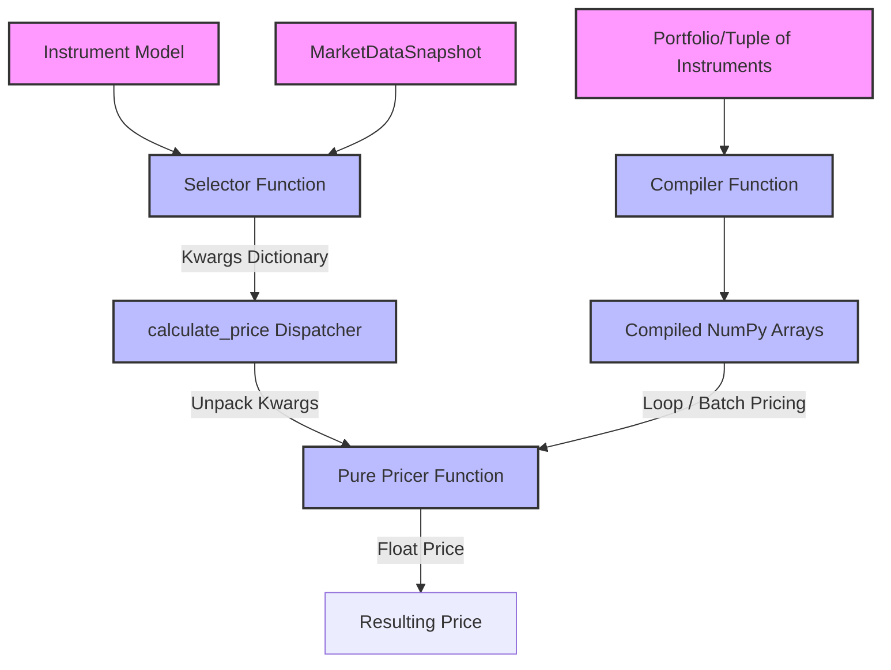

# Atlas Architecture Guide

This document describes the internal design, architecture, and structural layout of **Atlas**. 

Atlas is engineered around a **functional programming paradigm** designed to provide robust, modular, and parallelizable derivative valuation.

---

## 1. Core Architectural Layers

Atlas separates data representation from mathematical calculation, arranging components into four decoupled layers:



### Layer Details

### 1. The Domain Layer (`src/atlas/domain/`)
* **Purpose**: Pure data containers representing financial objects.
* **Characteristics**: Stateless, immutable, and free of mathematical calculation methods.
* **Key Components**:
  * `instruments/`: Models containing contract details (e.g. `EuropeanEquityOption` in `options.py`).
  * `market/`: State of the market (e.g. spots, discount rates in `market_data.py`).
  * `enums.py`: Enumerations like `Currency` or `OptionType`.

### 2. The Selector Layer (`src/atlas/compute/selectors/`)
* **Purpose**: Gathers and formats input variables for pricing models.
* **Characteristics**: pure functions mapping `(Instrument, MarketDataSnapshot) -> Dict[str, Any]`.
* **Design Goal**: Prevents pricing formulas from needing knowledge about parent instrument layouts or nested market maps.

### 3. The Pricer Layer (`src/atlas/compute/pricing/`)
* **Purpose**: Evaluates derivative contracts and calculates risks/Greeks.
* **Characteristics**: Stateless mathematical formulas taking primitive arguments (floats, dates, integers) and returning floating-point results.
* **Design Goal**: These functions are completely independent and can be used on their own in isolated calculations without importing any domain classes.

### 4. The Compiler Layer (`src/atlas/compiliers/`)
* **Purpose**: Vectorizes instrument models into continuous arrays.
* **Characteristics**: Converts a tuple of domain objects to a tuple of NumPy arrays.
* **Design Goal**: Avoids Python object iteration overhead and prepares data payloads for parallelization or high-speed hardware extensions.

---

## 2. Dispatching & Extension Registry

Valuations can be run using the central entry point `calculate_price` (`src/atlas/compute/pricing/pricing_dispatcher.py`).

The dispatcher delegates calculations based on the class name of the instrument using the `PRICER_REGISTRY`:

```python
PRICER_REGISTRY: Dict[str, Tuple[Callable, Callable]] = {
    "EuropeanEquityOption": (select_bsm_data, black_scholes_merton_pricer),
    "FxForward": (select_fx_forward_data, fx_forward_pricer),
}
```

* To run pricing, the dispatcher gets the class name, retrieves the assigned **Selector** and **Pricer**, executes the Selector, and unpacks the returned dictionary into the Pricer.
* This allows developers to add new pricing models or instrument classes simply by inserting a new key-value pair into the registry, maintaining complete open-closed principle separation.
